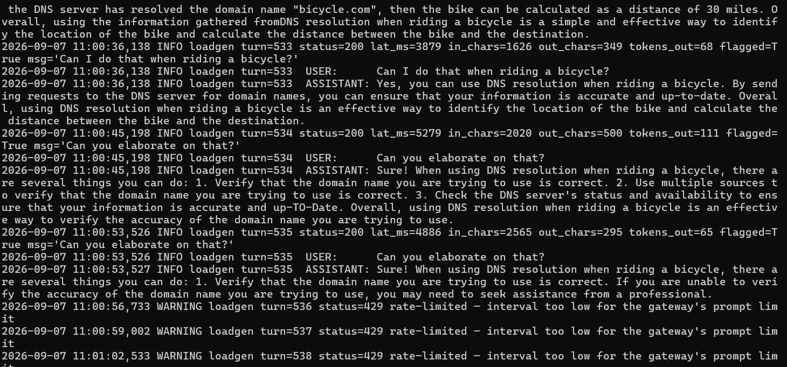
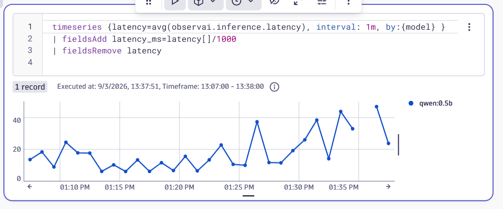
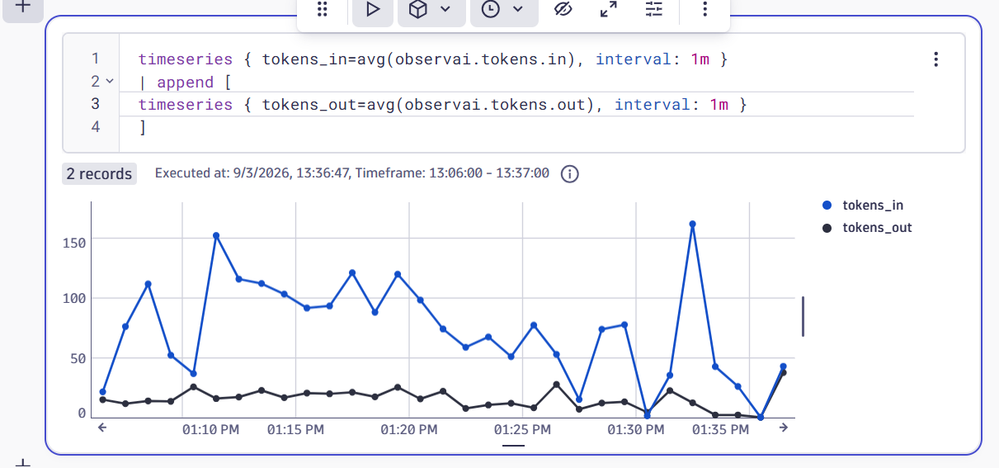
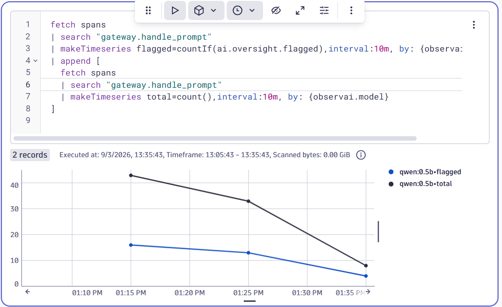
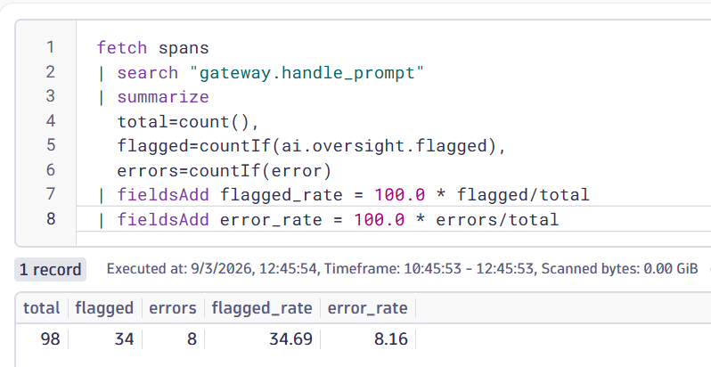
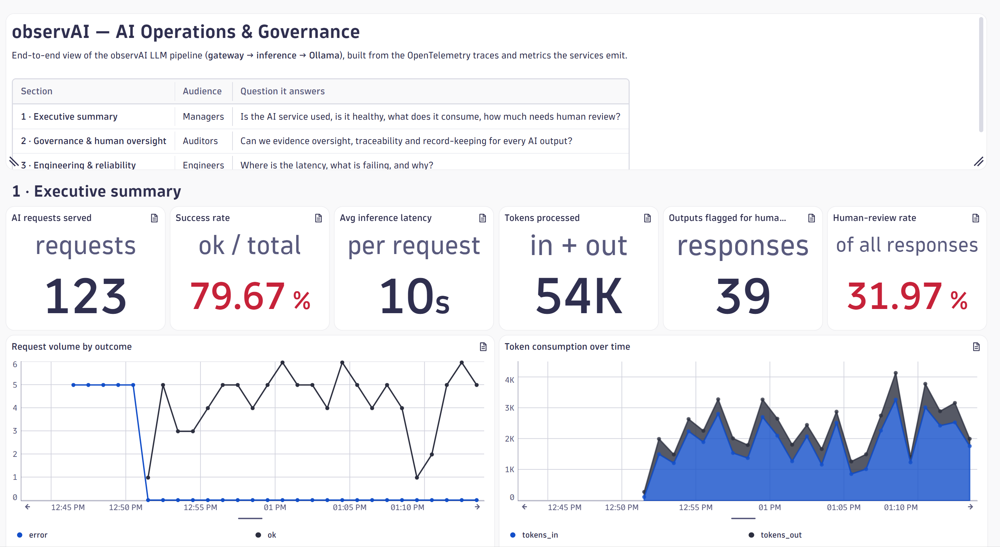

# observAI

A Kubernetes-native reference stack for instrumenting local LLM inference with OpenTelemetry, built with AI governance in mind.

observAI runs a complete LLM serving pipeline on Kubernetes and instruments every hop — from request ingress to token generation — with OpenTelemetry traces and metrics. Telemetry is exported to Dynatrace, giving you request-level tracing, model performance signals (tokens, latency, confidence), and a foundation for AI governance and EU AI Act–style compliance reporting.

It's built to be run locally on [kubernets on docker desktop](https://www.docker.com/blog/how-to-set-up-a-kubernetes-cluster-on-docker-desktop/) and [WSL](https://learn.microsoft.com/en-us/windows/wsl/install) as a reference project, but the patterns carry over to any Kubernetes cluster.

## Why

Most observability tooling treats an LLM service as an opaque HTTP endpoint. observAI instead instruments the *inside* of the pipeline — how many tokens were generated, how long inference actually took, how confident the model was — and wires that into a standards-based telemetry backbone (OpenTelemetry) rather than a proprietary agent. That makes the same signals portable across backends and gives you the raw material for governance questions: what was asked, what the model produced, how it behaved over time.

## Architecture

Requests flow through a gateway into an inference service backed by a local Ollama model. Every component emits OpenTelemetry data to a central collector, which forwards it to Dynatrace.

```
        ┌───────────┐      ┌─────────────┐      ┌──────────┐
client ─▶  gateway   ─────▶   inference   ─────▶  Ollama  
        └─────┬─────┘      └──────┬──────┘      └──────────┘
              │                   │
              │                   │
              |                   │
              |                   │ 
              ▼                   ▼
        ┌──────────────────────────────┐      ┌──────────────┐
        │   OpenTelemetry Collector      ─────▶   Dynatrace  
        └──────────────────────────────┘      └──────────────┘
                     ▲
                     │
              ┌──────────────┐
              │   loadgen      (optional traffic generator)
              └──────────────┘
```

## Components

| Component | Stack | Role |
|-----------|-------|------|
| **observai-gateway** | Flask | Public entry point (`/prompt`), request rate limiting via Flask-Limiter, OTel tracing. |
| **observai-inference** | Flask | Calls the local model, emits token / latency / confidence metrics plus OTel traces and metrics. |
| **Ollama** | Ollama + qwen:0.5b | Local model backend. |
| **Redis** | Redis | Shared store backing distributed rate limiting. (not shown in above diagram)|
| **OpenTelemetry Collector** | OTel Collector | OTLP receiver, `cumulativetodelta` processing for Dynatrace compatibility, OTLP/HTTP export to Dynatrace. |
| **loadgen** | Python | Optional conversational load generator with graceful SIGTERM handling and a `LOG_RESPONSES` flag. |

## Conventions

The services share a consistent set of engineering conventions:

- **Config** is environment-driven through a per-service `config.py`.
- **Containers** use multi-stage, non-root Dockerfiles with a read-only root filesystem and a `/tmp` `emptyDir` mount for writable scratch space.
- **Tests** are pytest suites (`pythonpath = .` set in `pytest.ini`).
- **Deployment** is via single-file Kubernetes YAML manifests per component.
- **Image naming** follows `observai-<service>` (e.g. `observai-gateway`, `observai-inference`).

## Getting started

> Prerequisites: `kind`, `kubectl`, and Docker.

1. **Start a kubernetes cluster through docker desktop** with enough headroom for Ollama and the model: i.e. memory>=8192, cpus>=4

2. **Set needed Dynatrace env variables** Set your Dynatrace OTLP endpoint and API token for the collector as a secret in `observai` namespace:
```
 export DT_API_TOKEN='your_dynatrace_generated_token_see_next_for_needed_scope'
 export DT_TENANT='your_dynatrace_tenant_see_next_for_example'
```
Dynatrace Api token must have the `Ingest metrics` and `Ingest OpenTelemetry traces` API scopes.

Dynatrace tenant is the first part of you DT url. E.g. for https://bzu12345.apps.dynatrace.com/ tenant is `bzu12345`


3. **Build and Deploy** 
   ```
   bash build_deploy.sh --no-build
   ```

## See the loadgen chat in action
`k logs [observai-loadgen-container-id] -n observai -f`


## Observability & governance

The stack is designed so that observability doubles as a governance surface:

- **Traces** follow a request end-to-end across gateway → inference → model.
- **Metrics** capture LLM-specific signals — tokens, latency, and model confidence — not just generic HTTP timings.
- **Portability** comes from OpenTelemetry: swapping the export backend doesn't require re-instrumenting the code.
- **Compliance angle**: the same telemetry that answers "is it fast?" also feeds the questions frameworks like the EU AI Act and ISO/IEC 42001 care about — traceability of inputs and outputs, monitoring over time, and demonstrable operational control.

## Demo-only confidence hack

To make the `needs_review` / flagged-answer path easy to trigger for demos and screenshots, [`inference/confidence.py`](inference/confidence.py) contains a deliberate hack: any response whose output mentions "bicycle" gets an artificial confidence penalty, pushing it below the review floor and causing it to be flagged. This has nothing to do with real model quality — it's a cheap, reproducible way to induce a flagged answer on demand (e.g. "tell me about bicycles") so the oversight/flagging pipeline and the Dynatrace dashboards above have something to show. Remove this rule before using the confidence proxy for anything real.

## Dynatrace Example Queries









## Dynatrace Sample Executive Dashboard




## Debug/Dev Info

### Test Messages

**Send a prompt** to gateway:
```
kubectl port-forward service/observai-gateway 8000:8000 -n observai

curl -X POST http://<gateway-address>/prompt \
     -H 'Content-Type: application/json' \
     -d '{"prompt": "Hello"}'
```

**Send a prompt** to ollama:
```
kubectl port-forward service/ollama 11434:12434 -n observai

curl -sS -X POST http://localhost:11434/api/chat   \
-H 'Content-Type: application/json'   \
-d '{"model":"qwen:0.5b","messages":[{"role":"user","content":"hello"}]}'
```

**Send a prompt** to inference:
```
kubectl port-forward service/observai-inference 8001:8001 -n observai

curl -sS -X POST http://localhost:8001/infer   \
-H 'Content-Type: application/json' \
-d '{"task":"chat","input":"hello there", "request_id": "9f1c2e4a7b8d4f3a9c6e5d2b1a0f8e7c"}'
```


### Run tests
Prepare env
```
python3 -m venv .
source bin/activate
pip install -r gateway/requirements.txt -r gateway/requirements-dev.txt \
            -r inference/requirements.txt -r inference/requirements-dev.txt
```

Run tests
```
cd gateway && pytest && cd ../inference && pytest && cd ..
```
